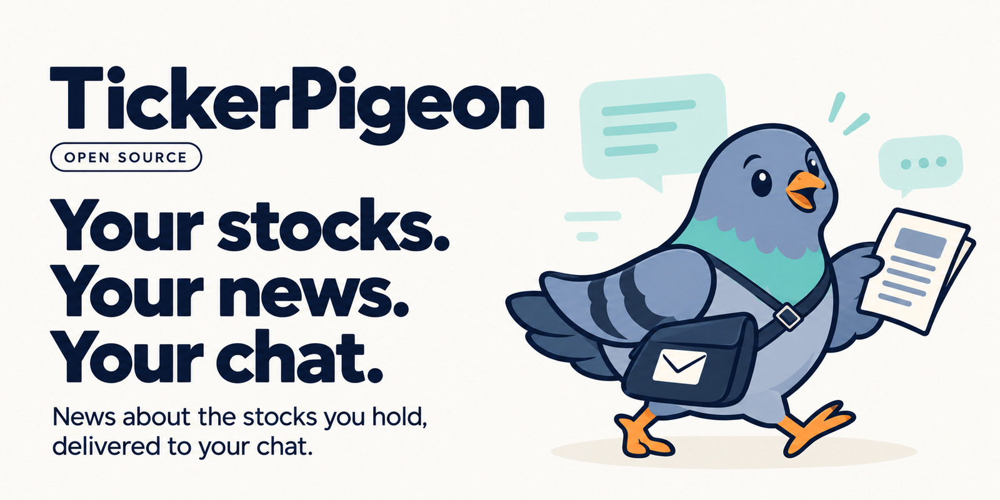
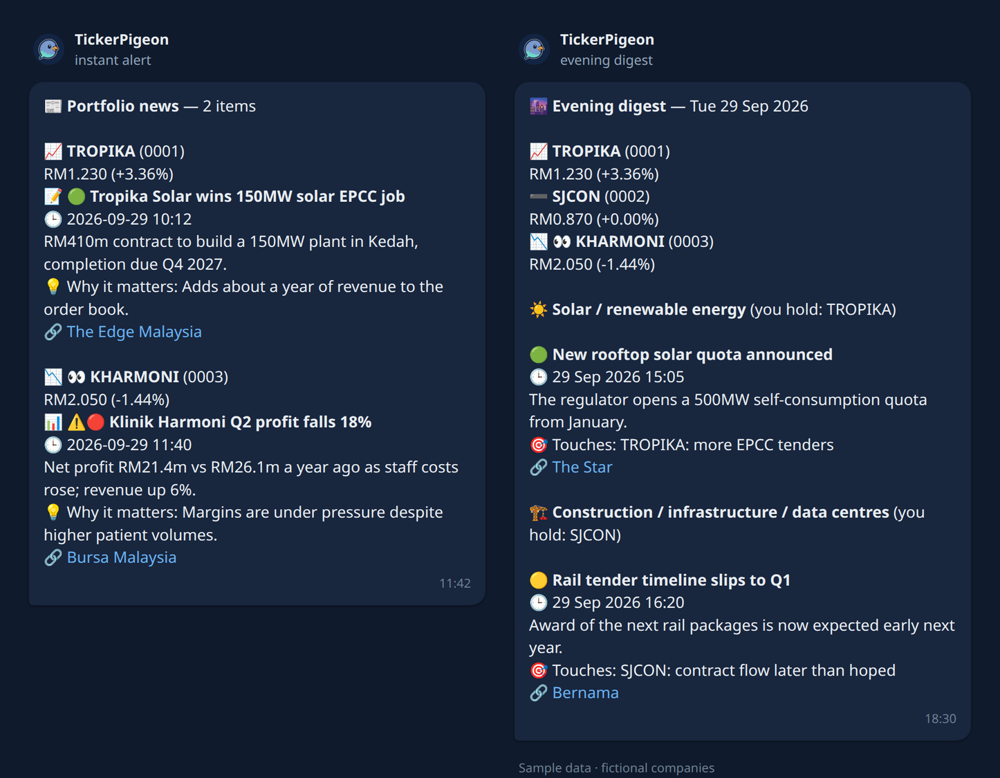
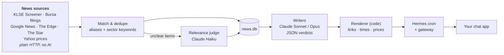

<p align="center">
  
</p>

<p align="center">
  <b>Your personal stock-news messenger for Bursa Malaysia.</b><br>
  Alerts when news names a stock you hold or watch, delivered to Telegram, Discord, Slack,<br>
  WhatsApp or any chat app Hermes Agent supports.
</p>

<p align="center">
  <a href="https://github.com/hanzong111/TickerPigeon/actions/workflows/ci.yml"></a>
  <a href="https://github.com/hanzong111/TickerPigeon/releases"></a>
  <a href="LICENSE"></a>
  
  <a href="https://github.com/NousResearch/hermes-agent"></a>
</p>

<p align="center">
  <a href="#quick-install">Install</a> ·
  <a href="#configuration">Configure</a> ·
  <a href="#usage">Use</a> ·
  <a href="#faq">FAQ</a> ·
  <a href="#disclaimer">Disclaimer</a> ·
  <a href="CONTRIBUTING.md">Contribute</a>
</p>

<p align="center">
  
</p>

> [!IMPORTANT]
> This is a research aid, **not financial advice**. AI summaries can be wrong, so check the linked
> source before you act. Some news sites limit automated access in their terms. Read the
> [disclaimer](#disclaimer) before you run it.

TickerPigeon is an open-source agent that follows the news about the Bursa Malaysia stocks you
hold, a watchlist of stocks you're considering, and the sectors they belong to. Pip, our courier
pigeon, brings short, skimmable briefs to your chat app, so you don't have to go looking. Pip only
flies when news names one of your stocks or touches its sector. There's no "quiet day" filler.

## Features

| Message | When (defaults) | What's in it |
|---|---|---|
| ⚡ **Instant alert** | Every 30 min, 08:00–18:30, Mon–Fri. Silent if nothing is new. | News or a Bursa announcement naming a stock you hold (or watch, marked 👀): sentiment, a 1–2 line summary, why it matters, the link and today's price. |
| 🌆 **Evening digest** | 18:30 Mon–Fri. Skipped if empty. | Sector and market news for the industries you hold (policy, commodities, contract flow, the Budget…), with the stocks each item touches. |
| 📅 **Weekly review** | Friday 20:00 | Each holding's week against the FBM KLCI, what moved and why, what to watch next week, suggestions and cautions. |
| 🗞️ **Malaysia headlines** | 09:00 / 14:00 / 21:00 | A tiered index of general Malaysian news. Reply "more politics" for the full list. |


- **Guided setup**, in the terminal or by sending `/setup` to your bot: search stocks by name
  or code, add a watchlist, pick your chat app, and choose which messages arrive when.
- **Chat with it:** "I bought KPJ", "watch Inari", "move the digest to 7pm", "anything new on
  Gamuda?". Answers come from what the jobs already collected, so chat stays cheap.
- **Trustworthy links:** models write the words, but code fills in every URL, time and price from
  the stored item, so a headline can't point at the wrong article.
- **Cheap to run:** matching is plain code, and a model only sees news that already concerns you.
  See [the FAQ](#faq) for real costs.
- **Extras:** a local read-only dashboard, a cost ledger, a chat model router (Opus for hard
  questions, Sonnet for easy ones) and an LSS6 tender watcher.

## How it works



- **Fetching and matching are plain Python.** No tokens go into deciding whether an item mentions
  a stock. A cheap model (Haiku) looks only at items the keyword rules couldn't place.
- **Models write words, code writes facts.** Agents return JSON verdicts keyed by item id. The
  renderer (`agents/renderer.py`) fills in links, times and prices from stored data.
- **Nothing is lost on a crash.** An item leaves the queue only after its message has been
  written, and the next run picks up anything left pending.
- **Hermes does scheduling and delivery.** Each message type is a
  [Hermes Agent](https://github.com/NousResearch/hermes-agent) cron job running a small wrapper
  script. The script's output is the message; empty output means nothing is sent.

## Quick install

On Linux, macOS or Windows (in WSL2), run:

```bash
curl -fsSL https://raw.githubusercontent.com/hanzong111/TickerPigeon/main/bootstrap.sh | bash
```


This installs everything that's missing and walks you through setup. It's safe to run again:
finished steps are skipped and nothing is duplicated. What it touches:

- **Asks first:** installing system packages with `sudo`, changing the time zone, and installing
  the Hermes gateway as a user service (systemd or launchd).
- **Writes:** the project folder (default `~/TickerPigeon`), Hermes Agent in `~/.hermes`
  (via [its official installer](https://hermes-agent.nousresearch.com)), and this project's
  wrapper scripts and chat skills in `~/.hermes/scripts` and `~/.hermes/skills`.
- **Downloads from:** GitHub (this repo), the Hermes installer site, your Linux distribution or
  Homebrew, and PyPI.
- **Never:** edits your shell profile itself (the Hermes installer may add `~/.local/bin` to your
  PATH), or runs anything as root without asking.

**Prefer not to pipe to bash?** Clone it, read the script, then run it:

```bash
git clone https://github.com/hanzong111/TickerPigeon.git
cd TickerPigeon
less bootstrap.sh
./bootstrap.sh
```

Options: `--yes` (answer yes to install questions), `--dir DIR` (where to clone, default
`~/TickerPigeon`), `--deliver discord` (pre-select your chat app), `--with-router` (install
the chat model router), `--skip-hermes-setup`.

## Prerequisites

`bootstrap.sh` installs every item marked *auto* for you. The others are accounts or settings only
you can provide.

| What | Why | How you get it |
|---|---|---|
| **Linux, macOS, or Windows + WSL2** | The pipeline is Python plus bash wrappers run by Hermes cron. | Windows: in PowerShell as admin, `wsl --install`, then run the installer inside Ubuntu. Native Windows isn't supported. |
| **git, curl** | Fetch the code and the installers. | *auto* (apt / dnf / yum / pacman / zypper / apk / Homebrew) |
| **Python ≥ 3.10 with `venv`** | Runs the pipeline in its own `.venv`. | *auto*: the system package, or `uv`'s Python 3.11 when the system one is too old (e.g. macOS's 3.9) |
| **[Hermes Agent](https://github.com/NousResearch/hermes-agent)** | Schedules the jobs, calls the AI models and delivers messages to your chat app. | *auto*: the [official installer](https://hermes-agent.nousresearch.com), which brings its own uv, Python 3.11 and Node |
| **An Anthropic account** | The agents use Claude models (Haiku / Sonnet / Opus). | An [Anthropic API key](https://console.anthropic.com/) or a Claude subscription login. You enter it during `hermes setup` (step 4 of the installer). |
| **A chat app bot** | Where your alerts arrive. | Any app Hermes supports: Telegram, Discord, Slack, WhatsApp, Signal, Feishu/Lark, WeChat, Matrix and more. Connect it in `hermes setup` (or later with `hermes setup gateway`), then pick it during our setup. Telegram is quickest: message [@BotFather](https://t.me/BotFather), `/newbot`, paste the token. |
| **Malaysia time zone** | Schedules are read as local time. | *auto*: the installer offers to switch to `Asia/Kuala_Lumpur`, or you keep your zone and enter local times during setup. |
| **A machine that's on** | Hermes cron runs locally, and missed runs catch up after sleep. | A laptop that's on during market hours works. For 24/7 use a small always-on box (mini PC, Raspberry Pi 5, a cheap VPS). |

It needs about 3 GB of disk: Hermes Agent with its own Python and Node toolchain is ~2.7 GB, and this project's venv is ~60 MB and outbound HTTPS to the news sources,
Yahoo Finance, Anthropic and your chat app.

## What the installer does

`bootstrap.sh` runs eight steps. Each step checks first and skips work that's already done.

| Step | What happens |
|---|---|
| 1. System packages | Installs git, curl and Python (+ `venv`) if missing |
| 2. Get the code | Clones this repo, or updates your clone with `git pull --ff-only` |
| 3. Hermes Agent | Runs the official installer if `hermes` isn't on your PATH |
| 4. AI provider + chat app | `hermes setup`: pick Anthropic, log in or paste a key, connect your bot |
| 5. Project install | Creates `.venv`, installs `requirements.txt`, copies the cron wrappers and chat skills into `~/.hermes` (`hermes/install.sh`) |
| 6. Time zone | Checks for UTC+8 and offers to switch |
| 7. Scheduled jobs | Creates the Hermes cron jobs (`hermes/cron/create-jobs.sh`) and makes sure the gateway (the scheduler) runs as a service. Where there's no systemd (some WSL setups, containers), it tells you to use `hermes gateway run` instead. |
| 8. Your stocks and messages | The setup wizard: holdings, watchlist, chat app, which messages and when. It ends with a test message. |

### Manual install (same steps, by hand)

```bash
curl -fsSL https://hermes-agent.nousresearch.com/install.sh | bash   # Hermes Agent
hermes setup                                                         # AI provider + chat app
git clone https://github.com/hanzong111/TickerPigeon.git && cd TickerPigeon
./hermes/install.sh                                                  # venv, deps, wrappers, skills
./hermes/cron/create-jobs.sh                                         # scheduled jobs
hermes gateway install && hermes gateway start                       # scheduler as a service
./.venv/bin/python -m pipeline.setup                                 # stocks, chat app, message times
```

You can skip the last line and send **/setup** to your bot instead, which runs the same setup in
chat. If Hermes lives somewhere other than `~/.hermes`, export `HERMES_HOME` first.

Until you've picked at least one stock, every job stays silent. The first scan after setup is
silent too: it records what's already published, so you aren't flooded with old news. Alerts
start from the next new story.

### What the setup asks

```
Step 1/4 · Stocks you hold
  Stock name or code (Enter when done): gamuda
    ✓ 5398 GAMUDA — Gamuda Bhd · sector: Construction / infrastructure / data centres
  Stock name or code (Enter when done): sunway reit
    1. 5211 SUNWAY — Sunway Bhd · sector: Construction …
    2. 5176 SUNREIT — Sunway Real Estate Investment Trust · sector: REITs
    Which one? (number, Enter to skip): 2

Step 2/4 · Watchlist — stocks you don't hold but want news on (alerts marked 👀)
  Stock name or code (Enter when done): inari
    ✓ 0166 INARI — Inari Amertron Bhd · sector: Technology / semiconductors / EMS

Step 3/4 · Chat app — where your messages arrive
  Connected in Hermes: 1. Telegram  2. Discord
  Send my messages to [telegram]: 2

Step 4/4 · Which messages, and when (Malaysia time)
  Instant alerts — news naming a stock you hold or watch, checked every 30 min
    Receive these? [Y/n]
    Alert hours, first-last (scans at :00 and :30) [8-18]: 9-17
  Evening digest — sector and market news touching your stocks, once a day
    Time [18:30]: 7pm
  Weekly review — your stocks' week vs the KLCI, what moved and why, what to watch
    Receive these? [Y/n]: n
  Malaysia headlines — general Malaysian news index
    Times, comma-separated [09:00,14:00,21:00]: 09:00,21:00
```

Stocks are looked up by name or code on Yahoo Finance. Setup fills in the Bursa code, short name,
headline aliases, a news search query and a suggested sector. You confirm the sector or pick
another. The results go to `data/portfolio.yaml` and `data/preferences.yaml` (both gitignored), and
setup moves the Hermes cron jobs to your chosen times.

## Configuration

### `data/portfolio.yaml`: your stocks

This file is the single source of truth for what you hold and watch. Setup writes it, and you
can edit it by hand too. It is read fresh on every run, so no restart is needed. It is
**gitignored**; `data/portfolio.example.yaml` shows the format.

`holdings` are stocks you own. `watchlist` entries use the same fields for stocks you're
watching. They get the same instant alerts (marked 👀), and the weekly review covers them in a
short section of their own, framed as possible buys.

```yaml
holdings:
  - code: "3336"                 # Bursa stock code (KLSE Screener / Bursa lookups)
    short: IJM                   # Bursa short name
    name: IJM Corporation Bhd
    sector: construction         # must be a key in sectors.yaml
    aliases: [IJM Corp, "IJM "]  # headline matches, case-insensitive; trailing space = whole word
    queries: ['"IJM Corp"']      # Google News searches for stock-specific news
    # qty / avg_cost             optional, for your own reference
```

Look up the code and short name at `https://www.klsescreener.com/v2/stocks/view/<code>`.
Choose aliases carefully. Short names that appear inside other words (`TNB`, `IJM`) need the
trailing space, or you'll get false alerts.

From the command line or chat:

```bash
./.venv/bin/python -m pipeline.setup add "kpj"             # or a code: add 5878
./.venv/bin/python -m pipeline.setup add "top glove" --watch
./.venv/bin/python -m pipeline.setup remove IJM
./.venv/bin/python -m pipeline.setup status
```

### `data/preferences.yaml`: which messages, and when

| Message | Settings | Default |
|---|---|---|
| `alerts` | `enabled`, `hours` (first-last hour, scans at :00 and :30), `days` (`weekdays` / `daily`) | on, 8-18, weekdays |
| `digest` | `enabled`, `time`, `days` | on, 18:30, weekdays |
| `weekly` | `enabled`, `day` (`mon`..`sun`), `time` | on, fri, 20:00 |
| `headlines` | `enabled`, `times` (list, all on the same minute) | on, 09:00 / 14:00 / 21:00 |
| `deliver` | the chat app every message goes to: `telegram`, `discord`, `slack`, `whatsapp`, `signal`, `feishu`, … or `app:chat_id` for a specific group or channel | the first app connected in Hermes |

Change them with `setup set`, which saves the file and updates the Hermes jobs in one step:

```bash
./.venv/bin/python -m pipeline.setup set digest.time=19:00 weekly=off headlines.times=08:00,20:00
./.venv/bin/python -m pipeline.setup set deliver=discord     # move every message to Discord
./.venv/bin/python -m pipeline.setup apps                    # chat apps connected in Hermes
./.venv/bin/python -m pipeline.setup test                    # send a test message there
```

After editing the file by hand, run `python -m pipeline.setup apply`. Each job fires a few
minutes early and holds its message until the chosen time, so it lands on the minute.

### `data/sectors.yaml`: industry themes

Each sector a holding points to has:

- `label`: display name
- `queries`: Google News searches for sector-level news (fed into the evening digest)
- `keywords`: case-insensitive substrings that tag a general-feed headline as belonging to the sector

A `macro` block (Budget, KLCI, OPR…) applies to every holding. `announcement_ignore` and
`announcement_high` tune which Bursa filings are noise and which are always important.
Sectors with no holdings are ignored.

The shipped file is a library of common Bursa sectors: solar, construction, healthcare, gloves,
banking, plantation, technology, REITs, property, oil & gas, telco, utilities, consumer,
transport, gaming and materials. Only sectors your stocks point to are scanned. Each sector's
`match` list (Yahoo industry names) lets setup suggest a sector for a new stock. Stocks that fit
none go under `other` and get their own news only. Add a block to cover a new theme.

### Environment variables

All are optional. See `.env.example` for the full list with defaults. The ones you're most
likely to change:

| Variable | Default | What |
|---|---|---|
| `HERMES_HOME` | `~/.hermes` | Where Hermes keeps state, cron jobs and its code |
| `AGENT_BACKEND` | `hermes` | `hermes` = one-shot `hermes chat` calls. `anthropic` = direct SDK (needs `ANTHROPIC_API_KEY` and `pip install anthropic`); slightly cheaper, no Hermes overhead |
| `BURSA_LOOKBACK_HOURS` | `72` | How far back a scan looks for new items |
| `BURSA_DELIVER_AT` | `prefs` (set in the wrappers) | Hold output until the time in `preferences.yaml`. Leave it unset for manual runs, which never wait |
| `BURSA_KLSE_CRAWL_DELAY` | `20` | Seconds between KLSE Screener requests (its robots.txt asks for 20) |
| `CURATOR_LLM` | `1` | `0` = nightly curation runs without the model |

Set per-job variables in the wrapper scripts under `hermes/scripts/`, then re-run
`./hermes/install.sh --force`.

### Models

The agents in `agents/` pin their own models (`agents/llm.py`):

| Role | Model | Job |
|---|---|---|
| judge, classifier, curator, memory keeper | Haiku | Labelling and relevance. Cheap, high volume |
| briefer, editor, digest writer | Sonnet | Deciding what matters and writing summaries |
| weekly review | Opus (set on the cron job) | Weekly analysis |
| renderer | none (code) | Final message layout, links, prices |

### Schedules and chat app

Message times and the chat app come from `data/preferences.yaml` (see above), and `setup apply`
pushes them to every job this project created. The housekeeping jobs (`bursa-curate`, `bursa-ops`
and the extras) keep fixed schedules from `hermes/cron/create-jobs.sh`, but they also follow your
chat app. Only apps connected in Hermes can receive: `setup status` warns when the chosen one isn't
connected.

### Optional: chat model router

`hermes/plugins/model-router` is a Hermes plugin. For each incoming chat message, a Haiku judge
labels it easy or hard. Hard questions (stock analysis, buy/sell, comparisons) run on Opus;
easy ones run on your default model. Install it with `./hermes/install.sh --with-router`.

## Usage

### From chat


Just talk to your Hermes bot. The `bursa-setup`, `bursa-portfolio` and `malaysia-news` skills handle:

- "/setup": the onboarding conversation (stocks, watchlist, messages and times)
- "I bought KPJ" / "I sold IJM" / "watch Top Glove"
- "move the digest to 7pm" / "stop the weekly review" / "headlines only at 9am"
- "send my alerts to Discord instead"
- "what do I hold?" / "how are my stocks doing?"
- "anything new on Gamuda?" / "catch me up"
- "why didn't I get an alert today?"
- "more economy" / "tell me about the haze story"

Chat answers from what the cron jobs stored. It doesn't browse the web itself.

### From the command line

Run these from the project directory with `./.venv/bin/python -m …`:

```bash
pipeline.setup                         # the setup wizard; `pipeline.setup --help` for the commands
pipeline.setup status                  # stocks, message times, whether Hermes jobs match
pipeline.scan --status                 # holdings + live prices
pipeline.scan --dry-run                # what would alert right now (commits nothing)
pipeline.scan --dry-run --force-recent 10   # last 10 holding items, seen or not
pipeline.digest --dry-run              # tonight's digest as it would be sent
pipeline.digest --dry-run --raw        # the queued items behind it (no model call)
pipeline.weekly                        # raw weekly review data
pipeline.news_index --preview          # Malaysia headline index preview
pipeline.news_index --more economy     # full list for one section

pipeline.memory stats                  # what's in the news memory
pipeline.memory query gamuda --days 30 # search stored items
pipeline.curate --dry-run --no-llm     # what clustering / pruning would do

pipeline.log runs -n 10                # recent runs: duration, LLM calls, tokens, result
pipeline.log show <run-id>             # one run as a timeline
pipeline.log tail --level WARN         # recent warnings/errors
pipeline.costs report --by-day         # token spend per job and model (needs cost-ledger)

pipeline.dashboard --port 9120         # local web console → http://127.0.0.1:9120
```

`hermes cron run <job-id>` fires a real job immediately.

## Project layout

```
bootstrap.sh        one-shot installer: prerequisites, Hermes, project, jobs, setup
pipeline/           fetch → match → memory → render; one module per cron job
  setup.py            setup wizard + commands   prefs.py       message times → cron schedules
  portfolio.py        stock lookup, portfolio.yaml editing
  scan.py             holding alerts            digest.py      evening digest
  weekly.py           weekly review data        news_index.py  Malaysia headline index
  curate.py           story clustering + prune  ops.py         watchdog
  fetchers.py         all HTTP sources          match.py       alias/keyword tagging, dedup
  memory.py           SQLite news memory        hold.py        deliver-at-time hold
  gnews_resolve.py    Google News → real URLs   lss6.py        LSS6 tender watcher
  costs.py, log.py    cost ledger, structured logs
  dashboard/          read-only web console
agents/             single-purpose LLM roles (JSON in, JSON out) + llm.py backend
hermes/             everything that gets installed into ~/.hermes
  install.sh          venv, wrappers, skills, plugin into ~/.hermes
  uninstall.sh        removes all of the above (and this project's cron jobs)
  scripts/            cron wrapper scripts (templated project path)
  skills/             chat skills: bursa-setup, bursa-portfolio, malaysia-news
  plugins/            model-router
  cron/               create-jobs.sh + the weekly-review prompt
data/
  portfolio.example.yaml   format reference; setup writes portfolio.yaml (gitignored)
  preferences.yaml         written by setup (gitignored)
  sectors.yaml             sector library: themes, news queries, industry matching
  state/, logs/            runtime, gitignored
docs/               research notes, the design plan, README images
.github/            CI (tests on Python 3.10–3.12, shellcheck), issue and PR templates
tests/              pytest suite
```

## Updating

```bash
cd ~/TickerPigeon
./bootstrap.sh          # pulls the latest code and refreshes the copies in ~/.hermes
```

Or by hand: `git pull && ./hermes/install.sh --force`. Replaced files are kept as `*.bak`. Your
stocks, preferences and news history in `data/` are never touched by an update.

Releases follow [Semantic Versioning](https://semver.org/): a major version (2.0.0) means a
breaking change, so read its notes first. Check your version with
`./.venv/bin/python -m pipeline.setup --version`. See [CHANGELOG.md](CHANGELOG.md) or the
[releases page](https://github.com/hanzong111/TickerPigeon/releases) for what changed.

## Uninstalling

```bash
./hermes/uninstall.sh   # removes this project's cron jobs, scripts, skills and plugin from ~/.hermes
rm -rf ~/TickerPigeon
```

Hermes Agent itself stays installed. Remove it with its own uninstaller if you don't use it for
anything else.

## FAQ


**What does it cost to run?** On the author's install (6 holdings, every message type on), the
scheduled messages cost about **US$0.45 a day, roughly $13.50 a month** at Anthropic's list prices.
Chat questions cost about $0.08 each. The Malaysia headline index is over half of the scheduled
cost, so switch it off (`setup set headlines=off`) if you only want stock news. With a Claude
subscription login instead of an API key there's no per-token bill. Check your own numbers with
`python -m pipeline.costs report`.

**Can I use another AI model?** The agents are written and tuned for Claude (Haiku, Sonnet, Opus).
Calls go through Hermes, so a different provider may work if you change the model names in
`agents/llm.py`, but it isn't tested.

**Does it work for other markets?** Not yet. Stock codes, the KLCI benchmark, MYR prices, the time
zone and the news sources are specific to Bursa Malaysia. The design would carry over, and
adapters for other markets are welcome.

**How fast are alerts?** Within 30 minutes of a story appearing on a source, during the alert
hours you chose. Bursa announcements carry a date only, so they sort after same-day news.

**Why did I get an old story when I added a stock?** A stock added after setup gets a one-off
catch-up of the last 3 days of its news. After that, only new stories alert.

**Why didn't I get an alert?** Run `python -m pipeline.log runs -n 10`, then
`python -m pipeline.log show <run>`. The `gate` line shows what matched and what was dropped. The
most common cause is an alias that doesn't match how headlines name the company. Add one to
`data/portfolio.yaml`.

**The laptop was asleep. Did I miss messages?** Missed jobs run when it wakes (Hermes'
`cron.catch_up_missed`, on by default). A late run delivers
at once instead of waiting for its usual time, and scans only alert on stories not yet sent.

## Disclaimer

- **Not financial advice.** Messages are automated summaries for your own research. They can be
  late, incomplete or wrong. Verify with the original source or Bursa Malaysia's announcements
  before you make a decision.
- **AI can make mistakes.** Summaries, sentiment and "why it matters" lines are written by
  language models, which can misread or leave things out. Links, times and prices come from the
  stored items, not from the model.
- **News sources and their terms.** This tool reads public listing pages, RSS feeds and APIs. Some
  of these sites restrict automated access or reuse in their terms of service. For example,
  KLSE Screener's terms prohibit robots and crawlers, and The Edge's terms forbid building a
  database from their content or using it commercially. You're responsible for how you use it.
  It's meant for personal, non-commercial use at a polite rate. It honours KLSE Screener's
  `robots.txt` crawl delay and never scrapes article bodies for alerts. Remove any source you're
  not comfortable using.
- **Your data.** Headlines and your stock list are sent to Anthropic (the AI provider) and your
  chat app provider. Searches naming your stocks go to Google News and Yahoo Finance. Your API keys stay in `~/.hermes/.env`, and your portfolio, preferences and
  history stay on your machine.
- **No warranty.** The software is provided as is, under the [MIT License](LICENSE).

## Contributing

Bug reports, sector improvements and new sources are welcome. Branch from `develop` and open your
pull request into `develop`. `main` holds releases and only the maintainer merges into it. See
[CONTRIBUTING.md](CONTRIBUTING.md) for the development setup and ground rules, and
[SECURITY.md](SECURITY.md) to report a vulnerability privately.

```bash
./.venv/bin/python -m pip install -r requirements-dev.txt
./.venv/bin/python -m pytest -q      # no network, no API keys, no Hermes needed
```

## License and credits

[MIT](LICENSE) © 2026 hanzong111. The TickerPigeon name, logo and Pip artwork are in
[`docs/brand/`](docs/brand/).

Built on [Hermes Agent](https://github.com/NousResearch/hermes-agent) by Nous Research, with
[Claude](https://www.anthropic.com/claude) models by Anthropic. Market data comes from Yahoo
Finance, KLSE Screener and Bursa Malaysia. News comes from the outlets linked in each message.
This project isn't affiliated with any of them.
